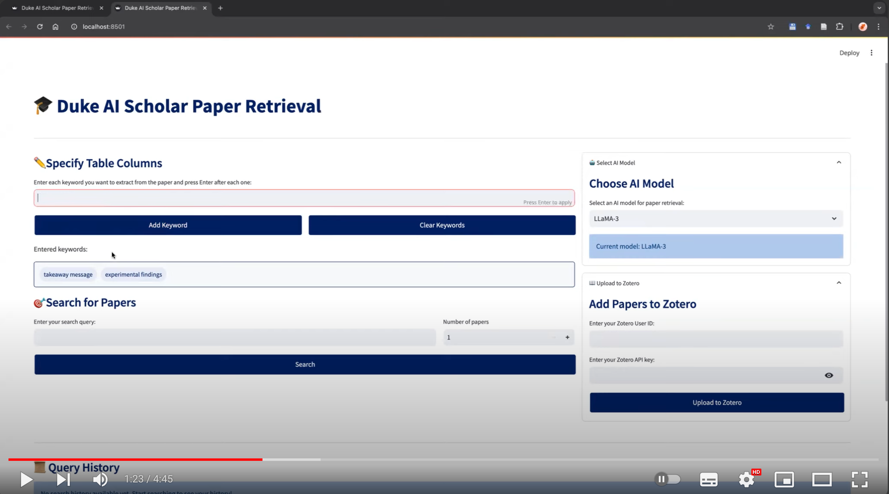
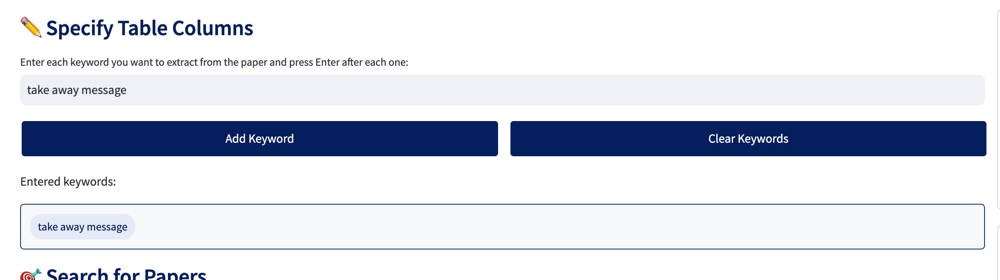
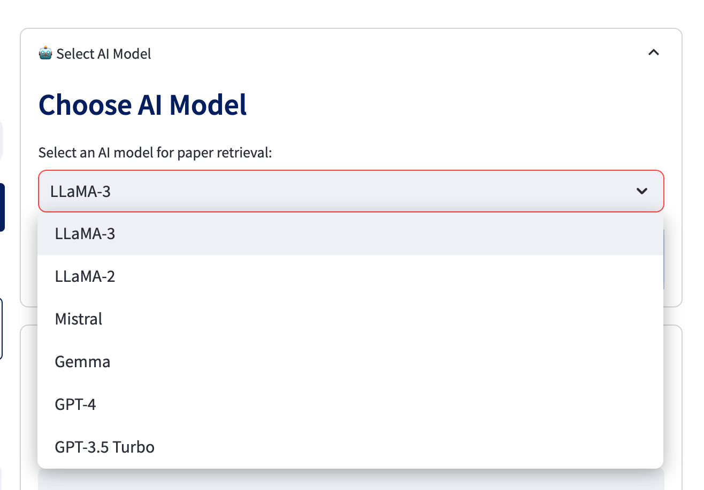
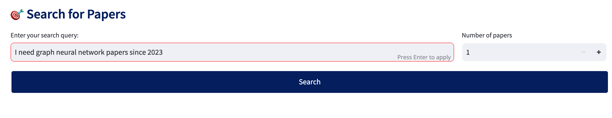
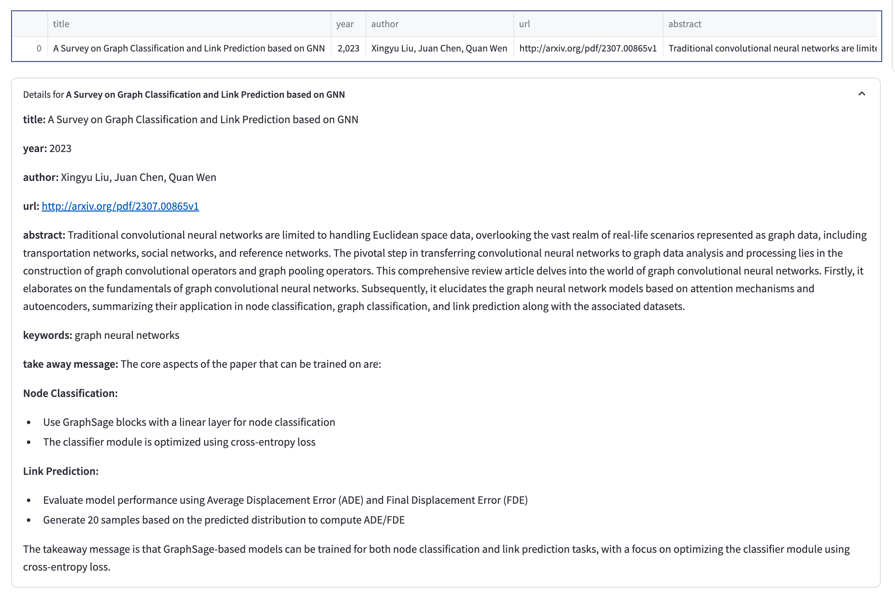
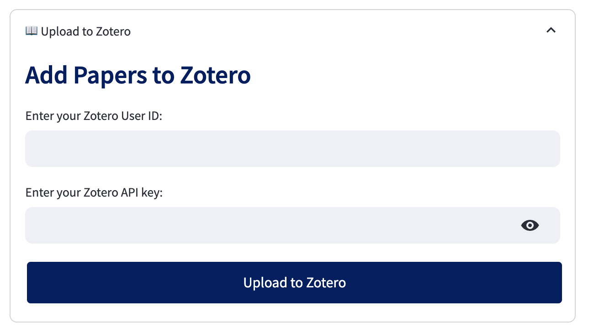
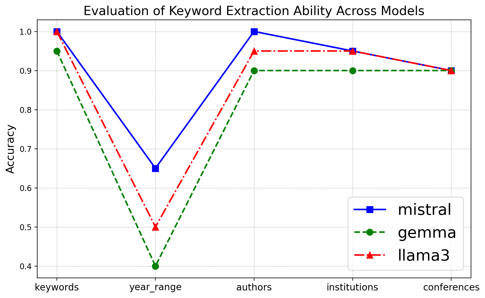
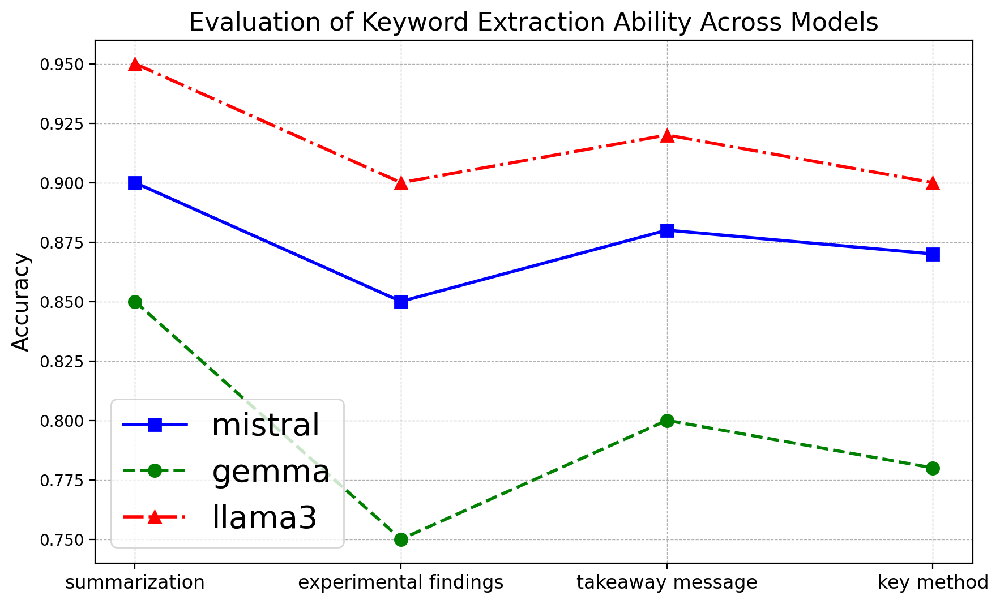

# Research Optimizer

## Project Propose
The rapid advancement of AI technologies demands a flexible and efficient paper retrieval system to keep researchers updated on the latest developments. In an era where timely access to cutting-edge research is crucial, a tool with fine-grained search capabilities—allowing retrieval based on keywords, authors, publication years, conferences, and institutions—is essential. This system would streamline the research process by integrating with major academic databases like arXiv and Google Scholar, while also supporting Zotero storage and customized analysis of paper content, enabling researchers to quickly capture and utilize emerging trends in their work.

## Demo Video

## Architecture Diagram

    

## Project Structure

## Setup Instructions

## Running the Application

## Example

### Step1 - Specify table column features

    

### Step2 - Choose your LLMs model

    

### Step3 - Input your target paper information

    

### Step4 - The retrieved papers are listed 

    

### Step6 - Save the paper into Zotero database

    

## Evaluation Results (GPT-4 Baseline)

This part mainly focus on evaluation 2 aspects of model ability **Keywords Extraction** and **User-defined Downstream Tasks**:

### Keywords Extraction

20 diverse queries are generated by GPT-4 to evaluate the user query keywords extraction ability of models.

- "keywords", accuracy is evaluated by whether there at least one keyword is matched
- "year_range", accuracy is evaluated by whether exactly the same as GPT-4
- "authors", accuracy is evaluated by whether exactly the same as GPT-4
- "institutions", accuracy is evaluated by whether exactly the same as GPT-4
- "conferences", accuracy is evaluated by whether exactly the same as GPT-4

    

### User-defined Downstream Tasks

The performance is evaluated by BLEU (bilingual evaluation understudy) score on 4 different common tasks performed on 10 papers.

    

## Cool Tool Experience

This AI agent is built using [Semantic Kernel](https://github.com/microsoft/semantic-kernel), which greatly simplifies development and provides nuanced control over AI behaviors. It also offers seamless integration with Azure services, ChatGPT, and local models with [Ollama](https://ollama.com). Building an AI agent with Semantic Kernel is straightforward: use the `add_service` function to integrate any model you need, and then create a class and use `add_functions` to equip your model with various capabilities. This approach makes maintenance easier, allowing for fine-tuned control of the agent’s behavior. Additionally, the prompt management system of Semantic Kernel integrates seamlessly with AI functions, enabling you to define variables within prompts to enhance the agent’s capabilities. This feature lays the foundation of my application.

Despite the documentation being somewhat disorganized and requiring me to read the source code, my experience with Semantic Kernel SDKs this summer has been impressive. Here are three key advantages of using Semantic Kernel:

1.	Simplified Integration: Easily integrate any LLMs model using the `add_service` function.
2.	Nuanced Control: Customize and manage agent behaviors easily with the `add_functions` feature.
3.	Effective Prompt Management: Seamlessly integrate and utilize variables within prompts to enable AI capabilities.

